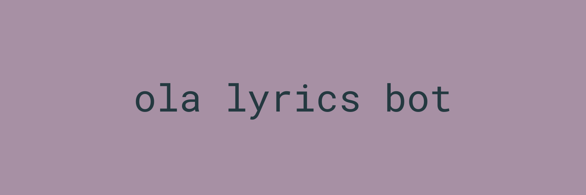

## ola lyrics bot
Connect to Spotify and Genius to post lyrics on [Twitter](https://twitter.com/olalyricsbot)

#### 🔧 Install
To run it locally, you will need to install libraries:

<code>
 import spotipy 
 import spotipy.oauth2 as oauth2 
 from spotipy.oauth2 import SpotifyOAuth 
 from spotipy.oauth2 import SpotifyClientCredentials 
 import lyricsgenius 
 import tweepy 
 import random 
 import os 
 from dotenv import load_dotenv 
</code>

### 🎓 Project
Ola lyrics bot was made as a course credit project.

*Faculty of Economic Sciences, University of Warsaw,
Wprowadzenie do programowania w języku Python, January 2022* 